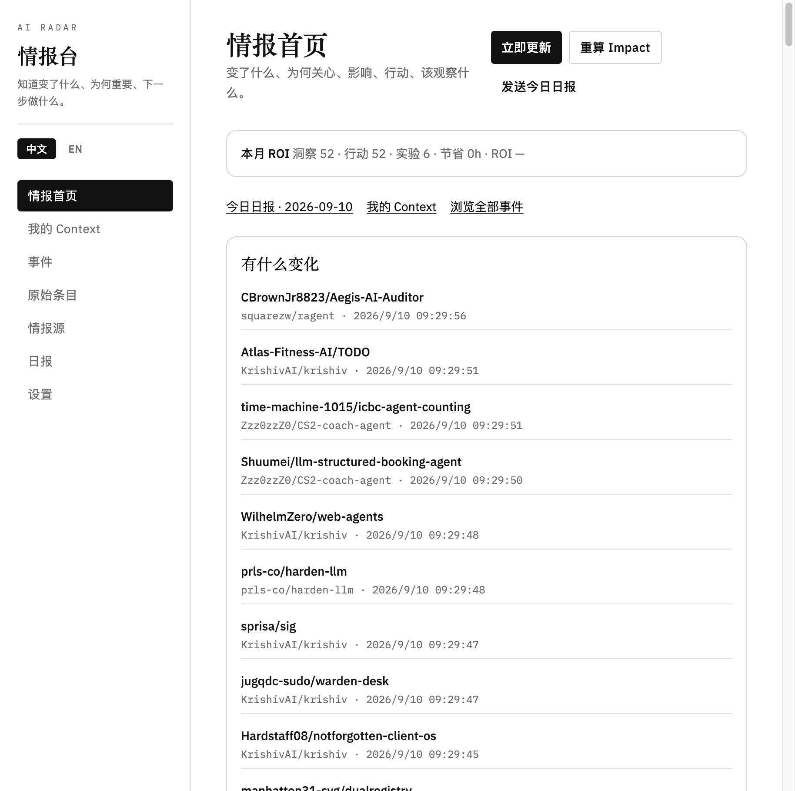
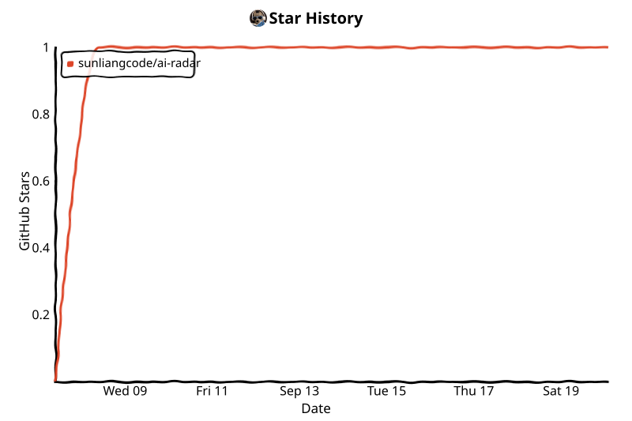

English | [中文](README.zh.md)

[](LICENSE)
[](https://github.com/sunliangcode/ai-radar/actions/workflows/ci.yml)


# AI Radar

**Your personal AI intelligence system.**

Know what changed. Know why it matters. Know what to do.

AI Radar turns AI news into decisions for your work — it watches the AI ecosystem, understands your projects and stack, and turns important changes into personalized actions.

[Demo](#demo) · [Quick Start](#quick-start) · [Documentation](#documentation)

**Stack:** Java 21 · Spring Boot 3 · SQLite · React/Vite/Tailwind · OpenAI-compatible LLM (optional)

## Demo



- **What changed** — What truly mattered in the AI world today?
- **Why care** — Why does this matter for *your* projects and stack?
- **What to do** — What should you do next?

### Demo story

1. Open Settings / Context and describe your role, projects, and tech stack.
2. Run a fetch — Radar surfaces **Changes** that match your world, not every headline.
3. Open a change to see **Impact**: why it matters to you, not a generic summary.
4. Take a recommended **Action** — a concrete next step you can execute or experiment with.

## Why AI Radar

Most AI news is noise. AI Radar filters that noise against your context and surfaces only changes worth your attention — then tells you what to do about them.

## How it works

```text
Your Context → Signals → Important Changes → Impact → Actions
```

## Quick start

```bash
git clone https://github.com/sunliangcode/ai-radar.git
cd ai-radar
./install.sh
```

Open [http://localhost:8080](http://localhost:8080).

Docker, dev mode, environment variables, and delivery channels: [docs/installation.md](docs/installation.md).

## Core features

- **Personal Context** — Profile, projects, and stack so relevance is about *you*, not global trends.
- **Change Detection** — Important external shifts, not an endless raw feed.
- **Impact Analysis** — Why a change matters for your work, in plain language.
- **Recommended Actions** — Concrete next steps (optional experiments & outcomes).

## Documentation

- [Docs index](docs/README.md)
- [Installation & operations](docs/installation.md)
- [Sources & packs](docs/sources.md)
- [API](docs/api.md)
- [Architecture / domain](docs/ai-radar-2.0-domain.md)
- [Delivery channels](docs/extending-delivery.md)
- [MCP](docs/mcp.md)
- [Connector development](docs/extending-connectors.md)
- [Contributing](CONTRIBUTING.md) · [Security](SECURITY.md) · [Changelog](CHANGELOG.md)

## License

MIT — see [LICENSE](LICENSE).

## Star History

GitHub restricted public stargazer API access in 2026, so hosted `api.star-history.com` badges no longer work for most repos. This chart is generated by [`.github/workflows/star-history.yml`](.github/workflows/star-history.yml) and committed into the repo.

<!-- star-history:start -->
<picture>
  <source media="(prefers-color-scheme: dark)" srcset="assets/star-history/star-history-dark.svg">
  
</picture>
<!-- star-history:end -->
