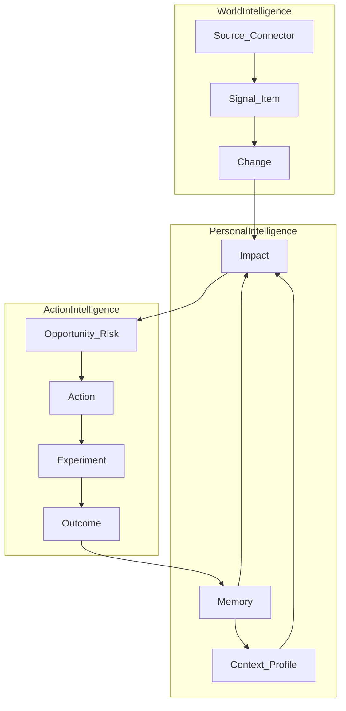

# 步骤 6 — AI Radar 2.0（个人 AI 决策系统）

## 目标

在 1.0（多源采集 → 去重评分 → Event → Brief → 推送 / MCP）已落地的底盘上，把产品从**信息聚合器**升级为**个人 AI 决策系统**：持续理解你的工作与技术栈，发现外部重要变化，判断对你的影响，并给出可执行的下一步。

一句话定位：

> **持续理解你的工作与技术栈，发现外部世界的重要变化，判断它对你的影响，并给出下一步行动。**

英文 tagline：

> **AI Radar — Know what changed. Know why it matters. Know what to do.**

本步**不推倒现有栈**（Java 21 + Spring Boot 3 + React/Vite + SQLite）。Connector / Dedup / Score / Event / Brief / Delivery / MCP **复用为 World Intelligence 底盘**，在其上叠加 Personal / Action Intelligence。

长文战略来源见 [`AI_Radar_新思路.md`](./AI_Radar_新思路.md)；本文是可执行蒸馏版。

## 参考来源

| 来源 | 借鉴点 |
| --- | --- |
| [`AI_Radar_新思路.md`](./AI_Radar_新思路.md) | 产品对象、七大引擎、UI 五问、Phase 0–5、KPI |
| [`01-pipeline.md`](./01-pipeline.md)～[`05-extensibility.md`](./05-extensibility.md) | 已落地管道、运行、UI、Event、扩展面 |
| 现网代码 | `connector/`、`pipeline/`、`event/`、`delivery/`、`provider/ai/`、`frontend/` |

## 产品定位与核心模型

### 1.0 → 2.0

| | 1.0（已完成） | 2.0（本计划） |
| --- | --- | --- |
| 心智 | 新闻 / RSS / 摘要中心 | 个人决策闭环 |
| 核心对象 | Source / Item / Event / Brief | + Profile / Context / Change / Impact / Opportunity / Risk / Action / Experiment / Outcome / Memory |
| 首页问题 | 今天有什么条目/事件？ | 变了什么？为何关心？影响？做什么？观察什么？ |
| KPI | 抓取数、源数量、Brief 数 | Relevant Changes、Actions、Experiments、Time Saved、AI ROI |

### 主链路

```text
Context
  ↓
Signal（复用现有 Connector → Item）
  ↓
Change
  ↓
Impact
  ↓
Opportunity / Risk
  ↓
Action
  ↓
Experiment
  ↓
Outcome
  ↓
Memory
```



### 三层产品结构

| Layer | 问题 | 现状 / 目标 |
| --- | --- | --- |
| World Intelligence | 世界发生了什么？ | 已有 Connector + Event；升级为 Change Detection |
| Personal Intelligence | 和我有什么关系？ | 新建 Context / Impact / Memory |
| Action Intelligence | 我该做什么、做得怎样？ | 新建 Opportunity / Action / Experiment / Outcome |

### 投入优先级（资源有限时严格按序）

| 优先级 | 模块 | 说明 |
| --- | --- | --- |
| P0 | Context Engine | 系统认识用户 |
| P0 | Change Engine | 从 Item/Event 升为「变化」 |
| P0 | Impact Engine | 变化 × Context → 为何关心 |
| P1 | Opportunity + Action | Interesting → Do something |
| P1 | Experiment + Outcome | 建议可验证、可度量 |
| P2 | Memory | 越用越懂你 |
| 降级 | 继续扩 Connector / 纯新闻摘要 / 更多数据源 | 底盘够用即可，非 2.0 主战场 |

## 交付物

建议在 `backend/src/main/java/com/airadar/` 下新增引擎包（命名可微调，原则是与现有 `pipeline` / `event` 并列，**不换技术栈**）：

```text
com.airadar/
├── connector/          # 复用：World Signal 采集
├── pipeline/           # 复用：Normalize / Dedup / Score / Brief
├── event/              # 复用：聚类底盘；逐步对齐 Change
├── context/            # 新增：Profile / Project / Tech / Interest / Goal
├── change/             # 新增：Change Detection（可先适配 Event）
├── impact/             # 新增：Context Matching + Impact 多维分
├── opportunity/        # 新增：Opportunity / Risk
├── action/             # 新增：Recommended Action
├── experiment/         # 新增：Experiment / Benchmark
├── outcome/            # 新增：Outcome / ROI 汇总
├── memory/             # 新增：Personal Intelligence Memory
└── ...
```

前端：首页从「条目/事件仪表盘」演进为 **Intelligence Home**（五问结构）；新增 `/contexts`、Change/Impact 详情、Action / Experiment 工作流页。

存储：继续默认 SQLite + JSON 字段；Embedding / 向量检索 / 完整 Knowledge Graph **后置**（Phase 2 可用 FTS + LLM + 规则匹配）。

### 引擎要点

1. **Context Engine**  
   自然语言 / Markdown / GitHub README / `pom.xml` 等导入 → Profile、Technology Graph、Project Graph、Interest、Goal；用户确认后生效。

2. **Change Engine**  
   多源 Signal 聚合成 Change（证据、置信度、趋势、首次发现时间）；可先从现有 Event 映射，再独立模型。

3. **Impact Engine**  
   Change × Context → 多维分：Relevance / Impact / Urgency / Confidence / Effort → Priority；每条必须有 Why / Evidence / Confidence / Recommendation。档位：High / Medium / Low / Ignore。

4. **Opportunity + Action**  
   机会（预计节省、覆盖面）与风险；输出可点的 Recommended Action（步骤、耗时、成功标准）。

5. **Experiment + Outcome**  
   启动实验、记录 Success Rate / Latency / Cost / Human Intervention；沉淀 Outcome 与 AI ROI。

6. **Memory**  
   偏好、曾尝试/拒绝、有效/无效、项目与长期目标；反馈到 Context 与 Impact。

### Intelligence Home（UI）

首页只回答五个问题：

1. **What changed?** — 过去 24h 重要变化  
2. **Why should I care?** — 与 Context 相关的变化  
3. **What is the impact?** — 对项目/技术栈/工作的影响  
4. **What should I do?** — 建议行动  
5. **What should I watch?** — 暂不行动、持续观察  

Explainability 链路：**Evidence → Reasoning → Recommendation**（UI 可展开，不黑盒甩分）。

## 任务清单

### Phase 0：重新定位（不堆功能）

- [x] 更新根 README / 产品文案：从「AI News Radar」明确为 Personal AI Intelligence
- [x] 统一 UI 术语：Intelligence Home、Change、Impact、Action（与 Items/Events/Brief 并存期写清映射）
- [x] 冻结 2.0 领域模型草图（本文主链路）并写入 `docs/` 或本文件附录
- [x] 架构说明：现有管道 = World 底盘；新引擎包落点约定
- [x] **明确本 Phase 不加新 Connector、不做新推送渠道**

### Phase 1：Context Engine

- [x] 领域：`Profile` / `Project` / `Technology` / `Interest` / `Goal` / `Preference`（SQLite 表或 JSON 文档）
- [x] API：`GET/PUT /api/contexts`；`POST /api/contexts/extract`（自然语言 → 结构化 Context）
- [x] 导入：Markdown；GitHub README；项目 `pom.xml` / 依赖清单（最小可用）
- [x] **GitHub Repository Import**：输入 repo URL → 语言 / 框架 / 依赖 / 架构线索 → Project Context
- [x] 前端：`/contexts` 创建、编辑、确认 AI 提取结果
- [x] 与现有 Settings 兴趣字段对齐或迁移，避免两套 Profile

### Phase 2：Change + Impact Engine（MVP 核心）

- [x] Change 模型：title、summary、evidence、confidence、trend、firstDetectedAt、sourceCount；与 Event 的映射/升级策略
- [x] Change Detection：在现有聚类之上输出 Change（可先规则 + LLM）
- [x] Context Matching：Change ↔ Context 相关性
- [x] Impact 多维分 + Priority 公式；输出 High / Medium / Low / Ignore
- [x] 每条 Impact：Why、Evidence、Confidence、Recommendation
- [x] Intelligence Home 最小版：What changed + Why care + Impact 三栏可读
- [x] 推送可选：仅 High Impact 摘要到飞书/邮箱（复用 Delivery）

### Phase 3：Opportunity + Action

- [x] Opportunity / Risk 对象与列表 API
- [x] 从 High Impact 生成 Opportunity（预计节省、覆盖工作类型）与 Risk
- [x] Recommended Action：步骤、预计耗时、成功标准；`[Start]` / `[Ignore]` / `[Watch]`
- [x] 首页第四节 What should I do? + Opportunities / Risks 区块

### Phase 4：Experiment + Outcome

- [x] Experiment：目标、任务集、指标（Success Rate、Latency、Token Cost、Human Intervention、Review Time）
- [x] 最小 Benchmark 工作流（可先手工录入结果，再接自动化）
- [x] Outcome 汇总与月度 AI ROI（Insights / Actions / Experiments / Time Saved / Cost）
- [x] 前端：实验详情与结果对比

### Phase 5：Personal Intelligence Memory

- [x] Memory 存储：喜欢/拒绝、有效实验、无效路径、项目与目标快照
- [x] Impact / Opportunity 生成时注入 Outcome History
- [x] 「越用越懂你」可演示路径：二次同类 Change 的推荐明显个性化
- [x] MCP（可选）：只读暴露 Context / High Impact / Active Experiments

## 验收标准

| Phase | 完成标准 |
| --- | --- |
| 0 | 对外定位与术语一致；贡献者能按本文找到引擎落点；无新 Connector 噪声 |
| 1 | 用户用一段自然语言或一个 GitHub URL 建立 Context，并在 UI 确认；后续评分/匹配可读取该 Context |
| 2 | 用户看到一个 Change 后，**不必自己判断「和我有什么关系」**——系统给出 Why + Impact 档位 + 证据 |
| 3 | 高价值信息从 Interesting 变成可点击的 Do something（Action 含成功标准） |
| 4 | 至少跑通一条 Experiment → 记录指标 → Outcome / ROI 可见 |
| 5 | 历史 Outcome 影响新的 Impact/推荐；可讲清「系统记得什么」 |

### 核心 KPI（取代 vanity metrics）

```text
Relevant Changes / Day
  → Actionable Insights / Week
  → Actions Accepted
  → Experiments Completed
  → Successful Experiments
  → Estimated Time Saved
  → AI ROI
```

不再把「源数量 / 抓取文章数 / Brief 篇数」作为 2.0 主成功指标。

### 建议 Demo（README / 开源叙事）

1. AI understands your context  
2. AI detects a high-impact change  
3. AI explains why you should care  
4. AI discovers an automation opportunity  
5. AI runs an experiment and measures the result  

### 建议 6 个月节奏（参考）

| 月份 | 焦点 |
| --- | --- |
| M1 | Context + Project Intelligence + GitHub Import |
| M2 | Change + Impact + Why should I care |
| M3 | Opportunity + Risk + Action |
| M4 | Experiment + Benchmark + ROI |
| M5 | Outcome + Memory |
| M6 | 打磨 Intelligence Home、Demo、文档与开源叙事 |

## 明确不做

- 推倒 Java / Spring / React / SQLite 重写，或为「AI 感」上 Kafka / Redis / ES / K8s
- Phase 0–2 优先上完整向量库、复杂 Agent 框架、完整 Knowledge Graph 基础设施
- 把主要精力继续堆新 Connector / 新闻摘要颜值 / Daily Brief 花样（Brief 可保留，但不是 2.0 护城河）
- 多租户 SaaS、Credits 计费、完整 Source Marketplace
- 复制第三方受版权或 AGPL 约束的源码
- 在 Memory / Outcome 未验证前过度承诺「完全自动驾驶」

## 与 1.0 的关系

| 1.0 能力 | 2.0 角色 |
| --- | --- |
| SourceConnector + Pipeline | World Signal 输入 |
| Event clustering / Timeline | Change 的过渡实现或证据层 |
| Brief / Delivery | 分发层；逐步改为 High Impact / Action 摘要 |
| Settings 兴趣 | 迁移进 Context |
| MCP 只读 Event/Brief | 扩展为 Context / Impact / Experiment（后期） |

**战略判断**：底盘保留；推倒的是产品思维——从 `Source → Item → Brief` 升级为 `Change → Impact → Action → Experiment → Outcome → Memory`。
