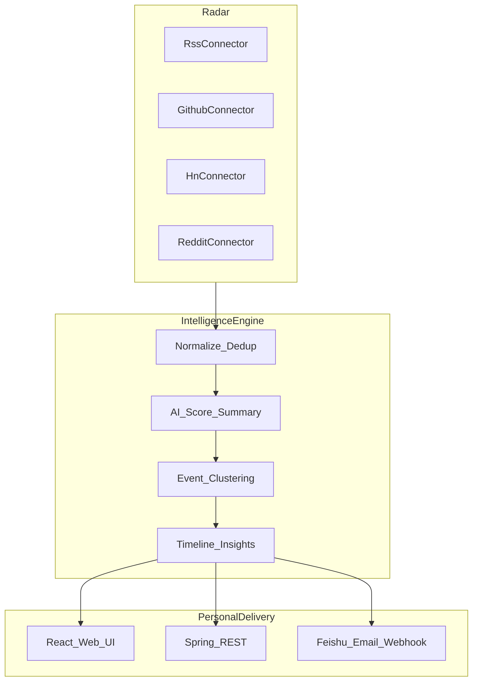

# AI Intelligence Radar — 执行计划总览

> 一句话定位（1.0）：**持续扫描 AI 信息，把分散消息聚合成持续演化的事件，解释影响，并推送到飞书/邮箱。**
>
> 下一阶段（2.0）：**持续理解你的工作与技术栈，发现外部重要变化，判断影响，并给出下一步行动。** 详见 [06-ai-radar-2.0.md](./06-ai-radar-2.0.md)。
>
> 本目录只放**可执行计划**。步骤 1–5 已在 `backend/` + `frontend/` + `mcp/` + `docs/` 落地；步骤 6（AI Radar 2.0）已实现 MVP。

## 已锁定决策

| 项 | 选择 |
| --- | --- |
| 用户场景 | 个人自用 / 自托管（本地一键跑，飞书/邮箱收日报） |
| 技术栈 | Java 21 + Spring Boot 3 + React/Vite + Tailwind |
| 存储默认 | SQLite（零外部依赖）；高级模式可选 Postgres |
| LLM | OpenAI-compatible（OpenAI / OpenRouter / 国内兼容端点 / Ollama） |
| 产品定位 | Event-oriented AI 情报雷达（不做 Horizon clone） |
| 参考仓库 | Horizon（管道）、News Agent（易用与推送）、Morning Deck（工程与 UI 形态） |
| 许可注意 | Morning Deck 为 AGPL：只借鉴架构模式与接口形状，**不复制其源码** |

背景方案见仓库根目录 [`推荐开源项目.md`](../推荐开源项目.md)。

## 阅读顺序

1. 本文件（总览与全局验收）
2. [01-pipeline.md](./01-pipeline.md) — 信息管道
3. [02-run-experience.md](./02-run-experience.md) — 极简运行与分发
4. [03-product-ui.md](./03-product-ui.md) — 产品化 Web UI
5. [04-event-intelligence.md](./04-event-intelligence.md) — 事件演化与情报
6. [05-extensibility.md](./05-extensibility.md) — 插件 / MCP / 市场预埋
7. [06-ai-radar-2.0.md](./06-ai-radar-2.0.md) — AI Radar 2.0（个人决策系统）

**建议实现顺序严格按 01 → 05**；每步通过验收后再进入下一步。步骤 6 在 1.0 底盘之上推进，长文背景见 [AI_Radar_新思路.md](./AI_Radar_新思路.md)。

## 目标架构（个人单机）

```text
                         ┌──────────────────┐
                         │  AI Radar Web UI │
                         └────────┬─────────┘
                                  │ REST
                         ┌────────▼─────────┐
                         │ Spring Boot API  │
                         └────────┬─────────┘
                                  │
         ┌────────────────────────┼────────────────────────┐
         ▼                        ▼                        ▼
   SourceConnector          IntelligenceEngine        Delivery
   RSS / GitHub             Normalize / Dedup         Feishu
   HN / Reddit              Score / Summary           Email
                            Event / Timeline          Webhook
                                  │
                                  ▼
                              SQLite
```



## 借鉴映射

| 来源 | 抄什么 | 落在哪一步 |
| --- | --- | --- |
| Horizon | Source → Dedup → Score → Enrich → Briefing | 步骤 1 |
| News Agent | 一键启动、定时任务、飞书推送、统一 News Pool | 步骤 2 |
| Morning Deck | Spring 分层、队列 Worker、React Sources/Briefs、AiService | 步骤 3 + 工程骨架 |

## 工程落点约定（实现阶段）

```text
ai-intelligence-radar/
├── aim/                    # 本计划（已存在）
├── backend/                # Spring Boot 3（步骤 1 已实现）
│   └── src/main/java/.../
│       ├── connector/      # SourceConnector SPI + 首批实现
│       ├── pipeline/       # Fetch / Dedup / Score / Brief
│       ├── event/          # Event clustering / Timeline
│       ├── provider/ai/    # OpenAI-compatible AiService
│       ├── delivery/       # Feishu / Email / Webhook
│       └── api/            # REST Controllers
├── frontend/               # React + Vite + Tailwind（步骤 3）
├── docker-compose.yml      # 可选一键启动
└── README.md               # 产品 README（实现时再写）
```

## 全局验收（五步全部完成后）

- [x] 新机器从零配置：安装 Java 21 + 填 LLM Key，**10 分钟内**在浏览器看到情报，并能收到飞书或邮件日报
- [x] 首批源 RSS / GitHub / HN / Reddit 可跑通全管道
- [x] 同一主题多条新闻可合并为 **1 个 Event**，并有可读 Timeline
- [x] Web UI 闭环：加源 → 看条目 → 看日报/四栏情报 → 改兴趣/推送设置
- [x] 第三方可按文档新增一个 Connector 或 Delivery，无需改核心管道
- [x] 默认依赖仅：JDK 21 + SQLite 文件（无 Kafka / Redis / ES / K8s 硬依赖）

## 刻意不做（全局）

- Kafka / Redis / Elasticsearch / Kubernetes
- 多用户权限、Credits 计费、SaaS / 多租户
- 内容创作工作流 / Podcast（Morning Deck 愿景项）
- 完整 Fact-check 市场、全球 Source Marketplace（属更后期）
- 复制 Morning Deck / Horizon / News Agent 的受版权或 AGPL 约束的源码

## 步骤状态

| 步骤 | 文件 | 状态 |
| --- | --- | --- |
| 1 信息管道 | [01-pipeline.md](./01-pipeline.md) | 已实现 |
| 2 运行与分发 | [02-run-experience.md](./02-run-experience.md) | 已实现 |
| 3 产品化 UI | [03-product-ui.md](./03-product-ui.md) | 已实现 |
| 4 事件情报 | [04-event-intelligence.md](./04-event-intelligence.md) | 已实现 |
| 5 扩展预埋 | [05-extensibility.md](./05-extensibility.md) | 已实现 |
| 6 AI Radar 2.0 | [06-ai-radar-2.0.md](./06-ai-radar-2.0.md) | 已实现（MVP） |

## 每个步骤文件的固定结构

1. 目标
2. 参考来源
3. 交付物
4. 任务清单（可勾选）
5. 验收标准
6. 明确不做
